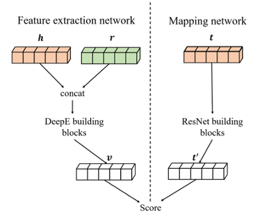

<h1 align="center">
  DeepE
</h1>
<h4 align="center">DeepE: a deep neural network for knowledge graph embedding</h4>
<p align="center">
  <a href="https://arxiv.org/pdf/2211.04620"></a>
</p>

<h2 align="center">
  
</h2>

## Abstract:
Recently, neural network based methods have shown their power in learning more expressive features on the task of knowledge graph em- bedding (KGE). However, the performance of deep methods often falls behind the shallow ones on simple graphs. One possible reason is that deep models are difficult to train, while shallow models might suffice for accurately representing the structure of the simple KGs.
In this paper, we propose a neural network based model, named DeepE, to address the problem, which stacks multiple building block- s to predict the tail entity based on the head en- tity and the relation. Each building block is an addition of a linear and a non-linear function. The stacked building blocks are equivalent to a group of learning functions with different non-linear depth. Hence, DeepE allows deep functions to learn deep features, and shallow functions to learn shallow features. Through extensive experiments, we find DeepE outper- forms other state-of-the-art baseline methods. A major advantage of DeepE is the robustness. DeepE achieves a Mean Rank (MR) score that is 6%, 30%, 65% lower than the best base- line methods on FB15k-237, WN18RR and YAGO3-10. Our design makes it possible to train much deeper networks on KGE, e.g. 40 layers on FB15k-237, and without scarifying precision on simple relations.

## Paper:
The code for paper： DeepE: a deep neural network for knowledge graph embedding.
https://arxiv.org/pdf/2211.04620

## Requirements:
To reproduce the results, 
1) install pytorch=1.12.1
2) unzip data.zip to data fold.
3) run sh files in ./scripts, e.g. sh run_WN18RR.sh:
  ```shell
  # FB15k-237
  python DeepE.py --data_path "./data" --run_folder "./" --data_name "FB15k-237" --embedding_dim 300 --min_lr 1e-5 --batch_size 1000 --log_epoch 2 --neg_ratio 0 --hidden_drop 0.4 --identity_drop 0.01 --target_drop 0.4 --num_source_layers 40 --num_target_layers 1 --num_inner_layers 3 --device cuda:1 --opt "Adam" --learning_rate 0.003 --weight_decay 5e-8 --factor 0.8 --verbose 1 --patience 5 --max_mrr 0 --epoch 1000 --momentum 0.1 --save_name "./model/FB15k237.pt"
  
  # WN18RR
  
  python DeepE.py --data_path "./data" --run_folder "./" --data_name "WN18RR" --embedding_dim 250 --min_lr 0.00001 --batch_size 1500 --log_epoch 2 --neg_ratio 1 --hidden_drop 0.4 --identity_drop 0 --target_drop 0 --num_source_layers 1 --num_target_layers 2 --num_inner_layers 3 --device cuda:1 --opt "Adam" --learning_rate 0.001 --weight_decay 5e-4 --factor 0.5 --verbose 1 --patience 5 --max_mrr 0 --epoch 200 --momentum 0.9 --save_name "./model/wn18rr.pt"
  ```
## Log:
  If you want to scan the results, you can turn to "./scripts".

## Model:
  You can download our models through this link:https://drive.google.com/file/d/1nZPXUhSJniaOMaPp3wF-_LFfEuBpWxw_/view?usp=share_link

## Citation:
@article{danhao2022deepe,
  title={DeepE: a deep neural network for knowledge graph embedding},
  author={Danhao, Zhu and Si, Shen and Shujian, Huang and Chang, Yin and Ziqi, Ding},
  journal={arXiv preprint arXiv:2211.04620},
  year={2022}
}

## Contact:
Feel free to contact me with any problems. 229369897@qq.com
